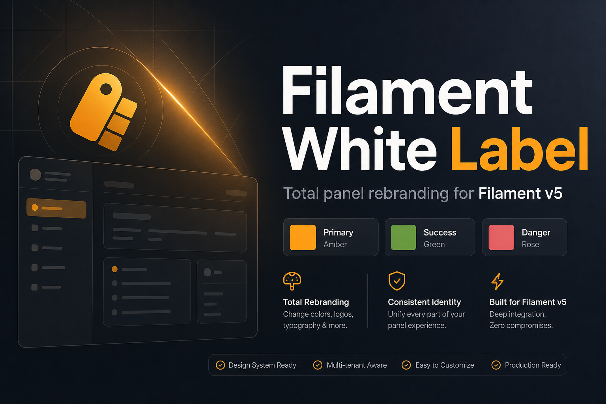
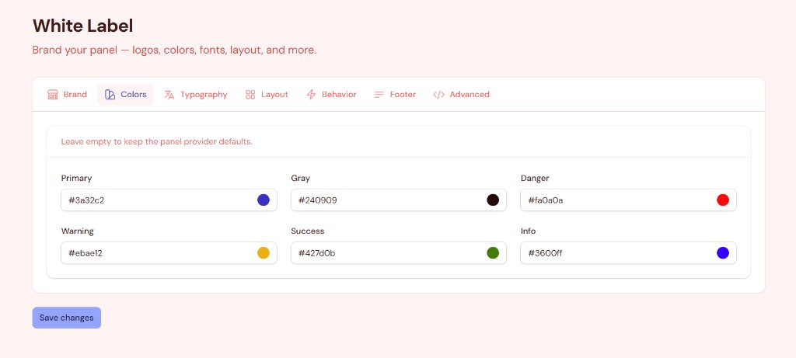
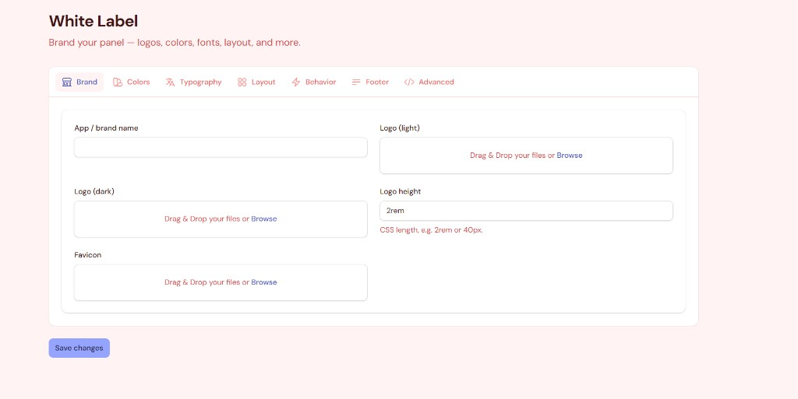

<p align="center" class="filament-hidden">
  
</p>

# Filament White Label

Total panel rebranding for **Filament v5** — no code edits required for day-to-day branding. Admins configure brand identity, theme colors, fonts, layout, behavior, footer, and custom CSS from a single settings page.

Works **per panel**, and optionally **per tenant** when Filament tenancy is active.

<p align="center">
  
</p>

## Requirements

| Dependency | Version |
|---|---|
| PHP | `^8.2` |
| Laravel | `^11` / `^12` |
| Filament | `^5.0` |

## Installation

```bash
composer require muazzambuilds/filament-white-label
```

Publish config (optional) and migrate:

```bash
php artisan vendor:publish --tag=filament-white-label-config
php artisan migrate
php artisan storage:link
```

The settings migration loads automatically via the package (`runsMigrations`). Publish config only when you need to override disks, cache, navigation, or defaults.

Link storage so uploaded logos and favicons are publicly reachable.

## Setup

### Register the plugin

```php
use MuazzamBuilds\FilamentWhiteLabel\WhiteLabelPlugin;

public function panel(Panel $panel): Panel
{
    return $panel
        ->plugin(
            WhiteLabelPlugin::make()
                ->navigationGroup('Settings')
                ->navigationSort(99)
                ->authorize(fn (): bool => auth()->user()?->is_admin ?? true),
        );
}
```

Open **Settings → White Label** in the panel.

### Fluent options

| Method | Purpose |
|---|---|
| `enabled(bool \| Closure)` | Toggle the entire plugin |
| `navigationLabel(...)` | Nav item label |
| `navigationGroup(...)` | Nav group |
| `navigationIcon(...)` | Heroicon / string icon |
| `navigationSort(...)` | Sort order |
| `registerNavigation(...)` | Show / hide nav item |
| `authorize(...)` | Who can open the settings page |

```php
WhiteLabelPlugin::make()
    ->navigationLabel('Appearance')
    ->navigationIcon('heroicon-o-paint-brush')
    ->authorize(fn (): bool => auth()->user()->can('manage-branding'));
```

## Features

### Brand identity

<p align="center">
  
</p>

| Setting | Description |
|---|---|
| **App / brand name** | Overrides the panel brand name (sidebar / topbar) |
| **Logo (light)** | Image used in light mode |
| **Logo (dark)** | Image used when dark mode is active |
| **Logo height** | CSS length (`2rem`, `40px`, …) |
| **Favicon** | Panel favicon (`png`, `ico`, `svg`, `webp`, `jpeg`) |

Uploads use the configured filesystem disk (`public` by default) under `white-label/`.

### Theme colors

<p align="center">
  
</p>
| Role | Use |
|---|---|
| `primary` | Buttons, links, accents |
| `gray` | Neutrals / chrome |
| `danger` | Destructive actions |
| `warning` | Warnings |
| `success` | Success states |
| `info` | Informational states |

Pick hex values in the UI — Filament builds the full shade palette via `FilamentColor`. Leave a role empty to keep the panel provider default.

Colors register early (plugin `register` + `FilamentColor`) so they actually reach the theme CSS variables. Saving settings hard-reloads the page so new colors apply immediately.

### Typography

- Curated **Bunny Fonts** list (Inter, Figtree, Outfit, JetBrains Mono, Playfair Display, …)
- Dropdown options render **in their own typeface** so you can preview before selecting
- Selected family is applied to the panel through Filament’s Bunny font provider

### Layout

| Setting | Description |
|---|---|
| Top navigation | Switch to top nav mode |
| Top bar | Show / hide topbar |
| Breadcrumbs | Show / hide breadcrumbs |
| Collapsible sidebar | Desktop collapse behavior |
| Fully collapsible sidebar | Icon-rail collapse |
| Collapsible nav groups | Group expand / collapse |
| Sidebar width | CSS length (`18rem`, …) |
| Max content width | `7xl`, `full`, `screen`, … or panel default |

### Behavior

| Setting | Description |
|---|---|
| SPA mode | Filament SPA navigation |
| SPA prefetching | Prefetch on hover (requires SPA) |
| Unsaved changes alerts | Warn before leaving dirty forms |
| Database notifications | Bell / DB notifications |
| Dark mode | Allow dark theme switching |

**Guardrails:** database notifications stay off unless the `notifications` table exists **and** the auth user model uses `Notifiable`. The toggle is disabled with a clear message when the environment is not ready — the panel will not crash.

### Footer

- Optional footer strip on every panel page
- HTML text supported (for short brand / copyright lines)

### Advanced — custom CSS

- Inject sanitized CSS into every panel page (`panels::styles.after`)
- `@import`, `javascript:`, `expression()`, and `behavior:` are stripped
- Size capped via `custom_css_max_length` (default 50KB)

## Multi-panel & tenancy

| Mode | Storage key | Behavior |
|---|---|---|
| Single panel | `panel_id` + empty `tenant_key` | One settings row per panel |
| Multi-tenant | `panel_id` + tenant key | Resolves current tenant; falls back to panel-global row |

Defaults from `config/filament-white-label.php` apply when no DB row exists yet.

## Safety & reliability

Built to stay **crash-free**:

- Missing settings / notifications tables → soft defaults + UI messages (no 500s)
- Invalid hex colors / media paths → ignored
- Unsafe behavior toggles → forced off on save with warning notifications
- Plugin boot wrapped in try/catch — branding failures are reported, panel still loads
- CSS sanitization on custom styles
- Aggressive caching with bust-on-save

## Configuration

```php
// config/filament-white-label.php

return [
    'navigation_group' => 'Settings',
    'navigation_sort' => 99,
    'navigation_icon' => 'heroicon-o-swatch',

    'disk' => 'public',
    'directory' => 'white-label',

    'cache' => [
        'enabled' => true,
        'ttl' => 3600,
        'key_prefix' => 'filament-white-label',
    ],

    'custom_css_max_length' => 50000,

    'defaults' => [
        // brand_name, logos, colors, layout, behavior, footer, custom_css…
    ],
];
```

## How it works (short)

1. Settings saved to `filament_white_label_settings` (`panel_id` + `tenant_key` + JSON `data`)
2. `WhiteLabelManager` merges DB data with config defaults (cached)
3. `WhiteLabelPlugin` applies values through Filament panel APIs + `FilamentColor`
4. Custom CSS / footer inject via panel render hooks

## Screenshots

| Brand | Colors |
|---|---|
|  |  |

## Testing

```bash
cd filament-white-label
composer install
vendor/bin/phpunit
```

## Changelog mindset

This package targets **Filament v5** only. Panel color registration follows Filament’s boot order (`FilamentColor` before plugin `boot`) so theme colors apply correctly.


## Support

If this package helps you, consider supporting development:

[](https://buymeacoffee.com/muazzambuilds)

## License
MIT — see [LICENSE](LICENSE).

---

<p align="center">
  
</p>

<p align="center">
  Built for the <a href="https://github.com/muazzambuilds">Muazzam Builds</a> Filament plugin suite.
</p>
